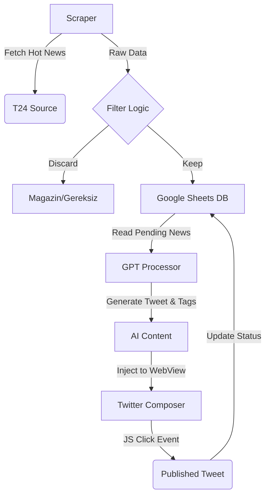

# AutoTweet: AI-Powered News Automation & Publisher

**AutoTweet** is a fully automated mobile tool designed to scrape breaking news, process the content using fine-tuned AI models, and publish tweets via a headless WebView mechanism. This project serves as a bridge between traditional news sources and social media, eliminating the need for expensive official APIs.

## 🚀 Key Features

* **Serverless Architecture:** Runs entirely on a mobile device (Flutter), utilizing **Google Sheets** as a real-time database and CMS.

* **Cost-Effective Twitter Automation:** Bypasses the paid X (Twitter) API by using a custom **Headless WebView Injection** method to simulate user interaction.

* **AI-Powered Content:**

  * Uses **OpenAI GPT (Fine-Tuned)** to rewrite news titles and summaries in a specific tone.

  * Auto-generates relevant hashtags based on content analysis.

* **Smart Scheduling:** Distributes tweets evenly over a time period (e.g., if 5 news items are found, it calculates safe delays between them) to mimic human behavior and avoid spam detection.

* **Category Filtering:** Automatically filters out unwanted categories (e.g., magazine, tabloid) before processing.

## 🛠️ Tech Stack & Architecture

* **Framework:** [Flutter](https://flutter.dev/) (Dart)

* **Database:** Google Sheets API (`gsheets` package)

* **AI Engine:** OpenAI API (GPT-3.5 Turbo Fine-Tuned)

* **Scraping:** HTML Parsing (`html` package, `http`)

* **Automation:** `webview_flutter` with JavaScript Injection

### System Workflow



## 📂 Project Structure

* **`scraper.dart`**: Handles HTTP requests to news sources, parses HTML DOM, and handles "Lazy Loading" structures effectively.

* **`gpt.dart`**: Connects to OpenAI. Uses a **Fine-Tuned Model** (`ft:gpt-3.5-turbo...`) to ensure tweets match a specific persona and generates context-aware tags.

* **`tweet_system.dart`**: The main logic brain. It manages the infinite loop, calculates random intervals for human-like timing, and orchestrates the Scraper -> AI -> Publisher pipeline.

* **`gsheets_api.dart`**: Manages CRUD operations on Google Sheets. Acts as the backend/admin panel for the app.

* **`webview_sender.dart`**: The core "Hack". Opens `twitter.com/compose/tweet`, injects the payload, and programmatically clicks the tweet button via JavaScript.

## ⚙️ How It Works (The "Magic")

### 1. The Headless Publisher

Instead of using the expensive Twitter API, the app opens a hidden `WebView` and executes JavaScript to click the "Post" button.

```dart
// Simplified Logic
controller.runJavaScript('''
window.onload = setTimeout(function() {
  document.querySelector("[data-testid='tweetButton']").click();
}, 4000);
''');
```

### 2. The AI Writer

The system uses a custom-trained model, not the generic ChatGPT, to maintain a consistent voice.

```dart
// gpt.dart
"model": "ft:gpt-3.5-turbo-1106:personal::8Vt8L8jl" // Fine-Tuned Model ID
```

### 3. The Human Pacing

To prevent getting banned, the bot calculates a "Job Time" and splits it by the number of news items.

```dart
// tweet_system.dart
// Spreads tweets over the allocated time block
await Future.delayed(Duration(seconds: (nextJopTime / newsCount).round()));
```

## 📦 Setup & Requirements

1. **API Keys:**

   * Create a `secret.dart` file in the `lib` folder.

   * Add your `bearerToken` (OpenAI), `gScredentials` (Google Service Account), and `spreadSheetsId`.

2. **Google Sheets:**

   * Create a sheet and share it with your Service Account email.

   * Define worksheets: `T24 Son Dakika`, `T24 Detailed News`.

3. **Authentication:**

   * Log in to Twitter **once** via the app's WebView interface to save session cookies.

## ⚠️ Disclaimer

This project is created for **educational and experimental purposes**. It demonstrates capabilities of mobile automation, web scraping, and AI integration. Using automated tools on platforms like Twitter/X may violate their Terms of Service. Use responsibly.

### Author

**Furkan** - Self-Taught Developer & Automation Enthusiast
